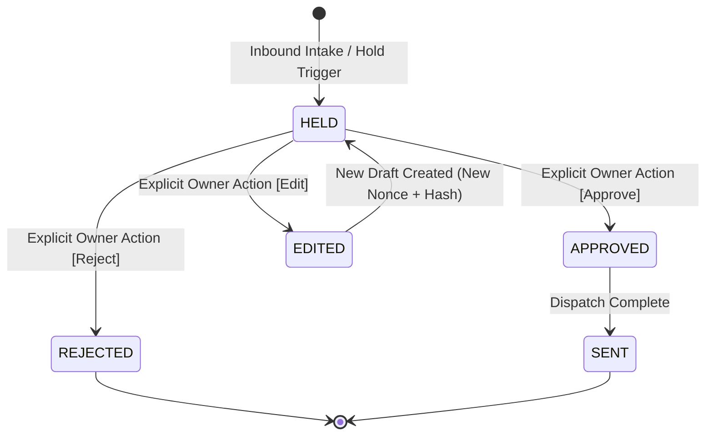

# ghostreply Specification (v0.1)

**Status:** DRAFT (Phase 1 Spec Gate C - Revised)  
**Target Repository:** `ghostreply`  
**License Proposal:** MIT / Apache-2.0 (Proposed, pending ownership confirmation)  
**Baseline Strategy:** Single clean sanitized baseline commit (Attribution details pending ownership confirmation)

---

## 1. Goals and Non-Goals

### 1.1 Goals
- **Multi-channel personal auto-reply**: Unify inbound messaging and drafts across WhatsApp and Telegram behind a channel-agnostic core.
- **Fail-Closed Safety**: Maintain the cardinal invariant: *"Never say something the owner wouldn't say; hold anything uncertain for owner approval."*
- **Strict Conjunction Auto-Send**: Autonomous sends occur if and only if every single safety check in the named `MANDATORY_AUTO_SEND_CONDITIONS` list passes.
- **Auditable Human-in-the-Loop Approval**: Provide an inline Telegram approval bot with state machine tracking and short callback tokens binding server-side nonces and draft hashes.
- **Lean Operational Footprint**: Run on a resource-constrained VPS (2 vCPU / 4 GB RAM) without local GPU dependencies.
- **Encrypted In-Memory Session**: Maintain MTProto Telegram credentials exclusively in volatile memory (`StringSession`), persisted at rest with Argon2id + AES-256-GCM and local-only unlock.

### 1.2 Non-Goals
- **No Unrestricted Autonomous Agent**: The agent never improvises outside explicit grounded knowledge.
- **No Group or Channel Engagement**: The MVP explicitly ignores group chats, supergroups, and broadcast channels.
- **No Outbound Voice Notes**: Outgoing voice message synthesis is disabled in MVP.
- **No Plaintext Cloud Credentials**: No cloud-managed master unlock keys; unlock is strictly local.
- **No Autonomous Non-English Sends in MVP**: Non-English messages are held for human review by default pending measurable evaluation gates.

---

## 2. Personas

### 2.1 Owner Persona
- **Role**: Busy professional / engineer receiving high-volume private direct messages on WhatsApp and Telegram.
- **Objective**: Delegate routine logistical inquiries, status checks, and scheduling questions while guaranteeing zero false sends or hallucinated promises.
- **Grounding & Style Source**: Sourced directly from original project design: short, casual, unpunctuated or lightly punctuated text matching owner's authentic voice; answers derived strictly from facts explicitly written down in `about_me.md` and `schedule.json`.
- **Tone Assumptions (*CLAIMED*)**: Prefers direct, minimal responses over corporate assistant verbosity.

### 2.2 Contacts
- **Allowlisted Contacts**: Known individuals configured in `contacts.json` or database with explicit interaction modes:
  - `auto_send`: Eligible for autonomous replies if all safety criteria pass.
  - `always_ask`: Always held for owner confirmation regardless of confidence.
  - `ignore`: Inbound messages dropped silently.
- **Non-Allowlisted Senders**: Default to `always_ask` or ignored; never eligible for autonomous reply.

### 2.3 Legacy Personas
- **Egyptian Arabic Persona**: *Legacy*. The initial prototype explored Egyptian Arabic / Franco-Arabic style heuristics. In ghostreply, Egyptian Arabic is archived as legacy test data; active auto-send focus is English, with Amharic held by default.

---

## 3. User Stories

- **US-01 (Routine Status Query)**: As the owner, when an allowlisted contact asks about my availability in English while I am busy, I want ghostreply to verify my schedule and send a factual reply automatically so the contact gets a prompt answer without interrupting me.
- **US-02 (Uncertain Commitment / RSVP)**: As the owner, when an inbound message asks for an agreement, promise, or financial transfer, I want the system to force a HOLD and prepare a draft so I can review it before any message is sent.
- **US-03 (Telegram Inline Approval)**: As the owner, when a draft is held, I want to receive an actionable notification in Telegram with [Approve], [Edit], and [Reject] buttons so I can approve the send with a single tap on my phone.
- **US-04 (Stale Tap Protection)**: As the owner, if I edit or reject a draft, I want any subsequent or replayed callback taps to fail gracefully so that stale or modified drafts cannot be sent inadvertently.
- **US-05 (Emergency Kill Switch)**: As the owner, if unexpected behavior occurs, I want to toggle an immediate kill switch remotely via Telegram or locally via the dashboard to halt all outgoing transmissions instantly.
- **US-06 (Amharic Inbound Inquiries)**: As the owner, when an inbound message is received in Ge'ez Fidel or Romanized Amharic, I want ghostreply to hold the draft for my review rather than risking an ungrounded or mistranslated auto-send.

---

## 4. Functional Requirements (FR-001 – FR-020)

### FR-001: Automatic Send Gate (`MANDATORY_AUTO_SEND_CONDITIONS`)
The system shall autonomously transmit a reply if and only if EVERY condition in the named `MANDATORY_AUTO_SEND_CONDITIONS` list evaluates to `true`. Failure of ANY single condition forces the draft to `HELD` status.

#### `MANDATORY_AUTO_SEND_CONDITIONS`:
1. `reply_non_empty`: Draft message content contains at least 1 non-whitespace character.
2. `chat_is_private`: Inbound chat is a 1-on-1 private direct message (not a group, supergroup, or channel).
3. `sender_allowlisted`: Sender identifier exists in the active contact allowlist.
4. `inbound_is_original_text`: Inbound message is standard direct text (NOT a forwarded message, NOT quoted text, NOT an edited message, NOT media/voice/image, NOT a link preview).
5. `message_not_stale`: Inbound message timestamp is within the allowable recency window ($T_{now} - T_{msg} \le 15\text{ minutes}$).
6. `language_is_confidently_english`: Language classifier classifies message as English with high confidence ($\ge 0.90$) AND message contains zero Ge'ez characters (`[\u1200-\u137F]`).
7. `inbound_prefilter_clean`: Inbound text matches zero financial triggers (*"telebirr"*, *"ብር"*, *"cbe"*, *"bank"*, *"pay"*), RSVP triggers (*"meet"*, *"come"*, *"attend"*), or promise triggers (*"promise"*, *"commit"*).
8. `draft_prefilter_clean`: Generated draft text matches zero unverified financial triggers, RSVP commitments, or promises.
9. `quoted_span_verified`: Every factual assertion in the draft is verified by verbatim substring matching against retrieved knowledge files (`about_me.md`, `schedule.json`).
10. `entailment_verified`: Independent secondary LLM judge, provided with the full draft and full retrieved knowledge context, verifies logical entailment.
11. `not_needs_owner`: Generation node does not flag `needs_owner = true`.
12. `contact_mode_allows_auto`: Contact configuration mode is `auto_send` (NOT `always_ask` or `ignore`).
13. `kill_switch_inactive`: Global database kill switch flag is `false`.
14. `not_in_shadow_mode`: Channel adapter configuration has `shadow_mode = false`.
15. `cooldown_and_rate_limits_clear`: Neither per-chat nor global send caps or cooldown thresholds are exceeded.

- **Given**: An inbound message and a generated draft reply.
- **When**: The draft is evaluated against `MANDATORY_AUTO_SEND_CONDITIONS`.
- **Then**: If all conditions hold, the draft transitions to `AUTO_SEND`. If ANY condition evaluates to `false`, the draft unconditionally transitions to `HELD`.

### FR-002: State Machine and Hold Invariant
Draft lifecycle shall be governed by an explicit finite state machine with states:
`HELD`, `APPROVED`, `SENT`, `REJECTED`, `EDITED`.

- **Invariant**: ONLY an explicit human action by the owner can transition a draft out of `HELD`. Automated checks, heuristics, secondary LLMs, or timeouts can NEVER transition a draft out of `HELD`.
- **Draft Edit Flow**:
  - When the owner edits a held draft (via Telegram or dashboard), the existing item transitions to `EDITED`.
  - A new held record is generated with a fresh server-side random nonce and newly computed draft-hash.
  - All existing callback buttons referring to the prior nonce/token are immediately invalidated.

### FR-003: Fail-Closed Language Verification
The language verification check must fail closed:
- If the language detector is not confidently English ($\text{confidence} < 0.90$), OR
- If the message contains any Ge'ez character (`[\u1200-\u137F]`),
the message is classified as non-English and forced to `HELD` with an approval notification to the owner.
- Autonomous non-English auto-sends are deferred to Phase 7 behind an empirical evaluation gate ($\ge 99.5\%$ safety precision across $\ge 200$ test cases).

### FR-004: Inbound Media Routing (Hold-by-Default)
Inbound voice notes, audio files, and images shall be held by default. Local STT (faster-whisper) and image captioning (BLIP) are optional extras, disabled by default in the lean operational profile.
- **Given**: Inbound message containing audio or image attachments.
- **When**: Intake pipeline evaluates the message.
- **Then**: Attachment is persisted for owner inspection, auto-send is prohibited, and status is set to `HELD`.

### FR-005: Outbound Modality (Text Only)
Outbound replies shall be strictly text-only. Outgoing voice synthesis is disabled by default.
- **Given**: An approved draft ready for transmission.
- **When**: The dispatch adapter prepares the outbound payload.
- **Then**: The payload is sent solely as plaintext. Outgoing audio synthesis is skipped.

### FR-006: Private Chat Scope
Only 1-on-1 private direct messages shall be processed. Group chats, supergroups, and broadcast channels shall be ignored silently.
- **Given**: An incoming message from a group or channel.
- **When**: Inbound adapter inspects chat metadata.
- **Then**: The message is dropped silently with zero processing and zero draft creation.

### FR-007: Multi-Channel Adapter Interface
The core engine shall interact with channels through an abstract `ChannelAdapter` protocol supporting namespaced identities (`wa:<id>`, `tg:<id>`), message reception, plaintext sending, identity resolution, and media retrieval.
- **Given**: An event from WhatsApp (`wa:1234567890`) or Telegram (`tg:987654321`).
- **When**: The adapter passes the event to core.
- **Then**: The core operates uniformly on the namespaced ID without platform-specific branch leakage.

### FR-008: Telegram Userbot & Approval Bot Topology
The system shall utilize a Telethon MTProto userbot for personal account monitoring and a dedicated official Telegram Approval Bot (`TELEGRAM_APPROVAL_BOT_USERNAME`) for owner approvals. Both shall run in a single process as supervised `asyncio` tasks.

### FR-009: Approval Bot Security & Compact Callback Tokens
The Approval Bot shall respond strictly to callbacks from `TELEGRAM_OWNER_ID` and drop third-party interactions silently.
- To respect Telegram's 64-byte `callback_data` limit, the 128-bit cryptographic nonce and draft SHA-256 hash shall be stored **server-side** in SQLite.
- The callback data shall carry a compact token: `a:<draft_id>` (Approve), `r:<draft_id>` (Reject), `e:<draft_id>` (Edit).
- When a callback is received, the server validates the owner ID, retrieves the server-side record, verifies the nonce is unconsumed and the draft hash matches, consumes the nonce, and executes the state transition.

### FR-010: Telegram Adapter Shadow Mode
The Telegram adapter shall ship with `TELEGRAM_SHADOW_MODE=true` by default. Under shadow mode, intake, draft generation, verification, and held notifications execute normally, but outbound transmission to contacts is suppressed.

### FR-011: Send-Time Kill Switch ("Restrict Remotely, Loosen Locally")
A global kill switch flag shall reside in the database and be queried immediately prior to any network send.
- **Remote Restrict**: The owner may engage the kill switch remotely by sending `/kill` to the Approval Bot.
- **Local Loosen**: Disengaging the kill switch or disabling shadow mode is strictly **local-only** (via 127.0.0.1 web dashboard or local CLI); chat commands to clear the kill switch are ignored.

### FR-012: In-Memory Telethon Session & At-Rest Encryption
The Telethon session credentials shall exist in memory solely as a `StringSession`.
- No plaintext `.session` file shall ever exist on disk while running or at rest.
- At rest, the session string is stored in a dedicated ciphertext file (`data/telegram_userbot.session.enc`) encrypted with Argon2id and AES-256-GCM.

### FR-013: Local-Only Unlock Flow
On boot, ghostreply starts in a `LOCKED` state.
- **Local Interface**: The unlock secret is accepted exclusively via HTTPS dashboard bound to `127.0.0.1` (accessed via SSH tunnel or private VPN) or local CLI.
- **Isolation**: The unlock secret is distinct from the dashboard login password.
- **Rate Limiting & Lockout**: Maximum 5 failed unlock attempts before a mandatory 15-minute lockout.
- **Security Boundary**: Systemd credentials or auto-unlock files protect solely against stolen cold storage backups, NOT against a compromised live host.

### FR-014: Userbot Safety & Rate Limits
The userbot shall operate solely on allowlisted private chats, implement randomized jitter delays (2.5s–6.0s), display typing state prior to sending, handle `FloodWaitError` with backoff, and prohibit bulk actions.

### FR-015: Threat Model & Prompt Injection Safeguards
Inbound message text, forwarded text, edited messages, quoted text, bot commands, and link previews shall be treated strictly as untrusted data. They must be wrapped in structural delimiters (`<untrusted_message>`) and excluded from system prompt instructions.

### FR-016: Public-Repo Privacy Hygiene
The repository code and tracked configurations shall contain zero real personal names, phone numbers, handles, home locations, or private schedules. All personal grounding data must be loaded from external, gitignored runtime files.

### FR-017: Idempotent Inbound Processing & Send Deduplication
Every inbound message shall be indexed by a composite unique channel ID (`channel:message_id`).
- When a send is initiated, the database row is atomically transitioned to `sending` state (`WHERE status = 'APPROVED'`) before network dispatch.
- Concurrent or duplicate webhook deliveries for the same message ID are discarded.

### FR-018: Stale Catch-Up Hold
If the inbound message timestamp is older than $N$ minutes ($N=15$ min by default, e.g. following process restart or prolonged offline downtime), the message shall be forced to `HELD` with reason `stale_catchup`.

### FR-019: Bot and Self-Message Prohibition
The system shall never reply to:
- Messages sent by automated bots (detected via userbot metadata `sender.bot == true`).
- Self-messages (messages where the sender ID matches the userbot's own account ID or `TELEGRAM_OWNER_ID`).

### FR-020: Per-Chat and Global Send Caps & Cooldown
The dispatch engine shall enforce:
- **Per-Chat Cooldown**: Minimum 60-second cooldown between consecutive auto-replies to the same contact.
- **Per-Chat Cap**: Maximum 3 automated replies per contact within any rolling 1-hour window. Subsequent messages are forced to `HELD`.
- **Global Cap**: Maximum 20 automated replies per hour across all contacts. Exceeding triggers an alert and defaults to `HELD`.

---

## 5. Non-Functional Requirements (NFRs)

- **NFR-01 (Lean Memory Footprint)**: Resident memory consumption on a 2 vCPU / 4 GB RAM VPS shall remain under 1.8 GB steady-state without local model weights loaded (*CLAIMED: pending measurement*).
- **NFR-02 (Latency)**: Decision pipeline latency shall remain under 4.0 seconds for 95% of standard inbound messages (*CLAIMED*).
- **NFR-03 (Reliability)**: SQLite WAL mode with busy timeout $\ge 5000\text{ms}$.
- **NFR-04 (Append-Only Auditability)**: Every state transition produces an append-only audit log record. Audit logs cannot be updated or deleted by application endpoints.
- **NFR-05 (Fail-Closed Availability)**: Any unhandled exception defaults status to `HELD`.

---

## 6. Out of Scope

- Autonomous processing of public channels, supergroups, or WhatsApp groups.
- Real-time voice synthesis.
- Multi-user SaaS multi-tenancy.
- Autonomous Amharic sends in MVP.

---

## 7. Open Questions

1. **Owner Confirmation**: Upstream author relationship and exact copyright holder name to finalize LICENSE and attribution text.
2. **Contact Allowlist Seeding**: Initial import workflow for `contacts.json` into SQLite database.

---

## 8. Requirements Traceability Matrix

| Requirement ID | Description | Roadmap Phase | Verification Method |
|---|---|---|---|
| **FR-001** | Automatic Send Gate (`MANDATORY_AUTO_SEND_CONDITIONS`) | Phase 3 (Safety Gate v2) | Unit & Integration Tests (Mocked LLM) |
| **FR-002** | Explicit State Machine & Hold Invariant | Phase 3 (Safety Gate v2) | Adversarial Verifier Unit Tests |
| **FR-003** | Fail-Closed Language Verification | Phase 3 (Safety Gate v2) | Multi-Lingual Regex & Eval Suite Tests |
| **FR-004** | Inbound Media Routing (Hold-by-Default) | Phase 3 (Safety Gate v2) | Attachment Handling Integration Tests |
| **FR-005** | Outbound Modality (Text Only) | Phase 2 (Channel Seam) | Dispatch Unit Tests |
| **FR-006** | Private Chat Scope | Phase 2 (Channel Seam) | Inbound Filter Unit Tests |
| **FR-007** | Multi-Channel Adapter Interface | Phase 2 (Channel Seam) | Adapter Protocol Mock Conformance Tests |
| **FR-008** | Telegram Userbot & Approval Bot Topology | Phase 4 (Telegram Adapter) | Asyncio Process Integration Tests |
| **FR-009** | Approval Bot Compact Tokens & Security | Phase 5 (Approval Bot & Controls) | Nonce Replay & Callback Unit Tests |
| **FR-010** | Telegram Shadow Mode | Phase 4 (Telegram Adapter) | Dispatch Suppression Integration Tests |
| **FR-011** | Kill Switch (Restrict Remotely, Loosen Locally) | Phase 5 (Approval Bot & Controls) | Permission Boundary Tests |
| **FR-012** | In-Memory Telethon Session & Encryption | Phase 4 (Telegram Adapter) | Cryptographic Storage Unit Tests |
| **FR-013** | Local-Only Unlock Flow & Rate Limiting | Phase 4 (Telegram Adapter) | Auth State Machine Tests |
| **FR-014** | Userbot Safety & Rate Limits | Phase 4 (Telegram Adapter) | Delay & Backoff Emulation Tests |
| **FR-015** | Threat Model & Prompt Injection Safeguards | Phase 3 (Safety Gate v2) | Injection Case Eval Suite Tests |
| **FR-016** | Public-Repo Privacy Hygiene | Phase 1 (Bootstrap & CI) | Gitleaks & Secret Sweep Tests |
| **FR-017** | Idempotent Inbound Processing & Deduplication | Phase 2 (Channel Seam) | Concurrent Delivery Tests |
| **FR-018** | Stale Catch-Up Hold | Phase 3 (Safety Gate v2) | Timestamp Offset Unit Tests |
| **FR-019** | Bot and Self-Message Prohibition | Phase 2 (Channel Seam) | Sender Type Filter Tests |
| **FR-020** | Per-Chat & Global Send Caps / Cooldown | Phase 5 (Approval Bot & Controls) | Rate Limiting Logic Tests |

---

## 9. Evidence Status & Relabeled Assumptions

- `telethon==1.45.0` pinned version: **VERIFIED** (`pip index versions telethon`, 2026-10-07).
- Git repository clean status: **VERIFIED** (`git status`, 2026-10-07).
- PyPI / GitHub package name availability: **VERIFIED** (HTTP 404 queries, 2026-10-07).
- Pyrogram license (LGPLv3): **VERIFIED** (PyPI metadata query, 2026-10-07).
- VPS Resident Memory Profile (< 1.8 GB lean): **CLAIMED** (Phase 0.5 estimate pending Phase 6 benchmarking).
- Whisper / MMS Word Error Rates (> 75% / 52%): **CLAIMED** (Phase 0.5 research finding pending Phase 7 evals).
- LLM Token Efficiency & API Cost ($0.30/mo): **CLAIMED** (Phase 0.5 model calculation pending production telemetry).
